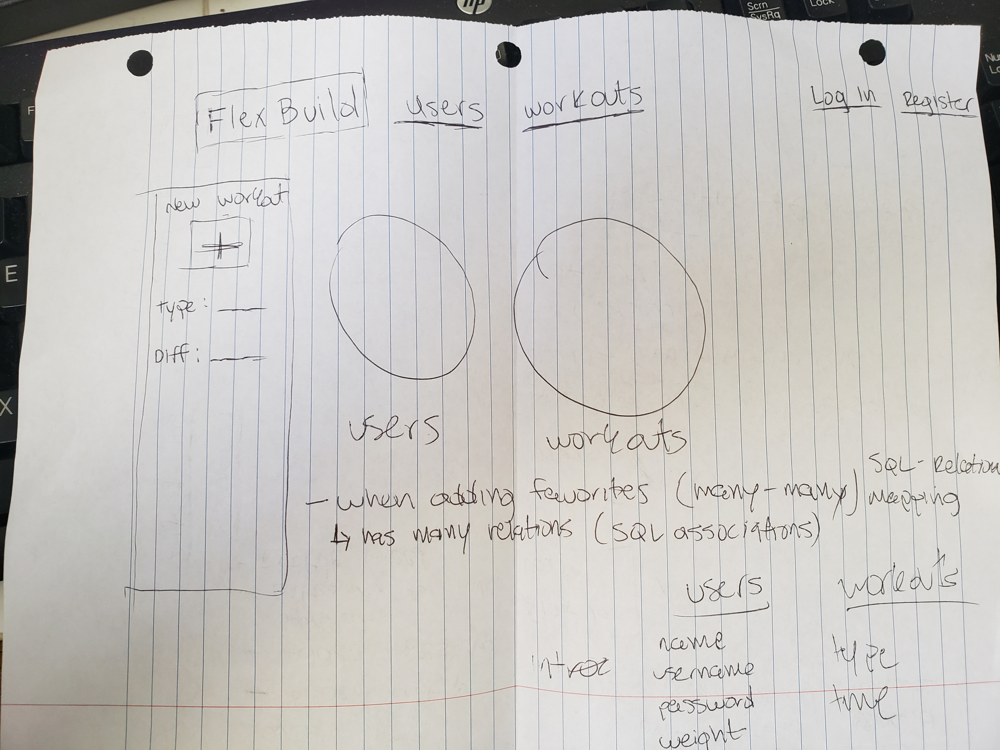

# ZacBenckendorf - FlexBuild App

# Wireframe 

# List of Features
- Two Models were developed, a User model, and a Workout model. Both models incorporate all 7 RESTful routes with full CRUD.
- The models User and Workout are associated by Users having zero to many workouts and Workouts belonging to a User. 
- FlexBody is deployed online and accessible to the public via Heroku
1. Should be able to GET new User
2. Should be able to GET show pre-existing User
3. Should be able to GET index of Users
4. Should be able to GET edit form for User
5. Should be able to PUT update info for User
6. Should be able to GET new workout
7. Should be able to GET show pre-existing workout
8. Should be able to GET index of workouts
9. Should be able to GET edit form for workout
10.Should be able to PUT update info for workout

# Technologies Used:
- **Command Line:** used for working in the code through the browser. Also, useful tool for checking the location of errors.
- **Terminal:** used to track local changes of Git repo and upload chnages on code to Git repo.
- **Visual Studio code:** used for coding with Html5, CSS6, and JavaScript.
- **Google Chrome:** Browser used to launch website.
- **Codepen.io:** used for css design.
- **Node.js:** used for back end development
- **Postgres:** used for the database tied to my application 

# Installation:
**What you will need:**
- **Web Browser**
- **Internet**
- **Javascript support**
- **Command Line:** Need practicee navigating file system.
- **Github**
- **Web/Browser fundamentals:** Ability to communicate with browser and understand functionality.
- **Deployment:** Host a static web site in a managed hosting environment.

# Solved/Unsolved Problems:
- **Encrypted Password(Silver)** SignUp/Login has encrypted password authrization flow (yes)
- **Use Bootstrap sheet(Silver)** Used Boostrap stylesheet for main homepage (yes)
- **Profile Picture(Silver)** User has profile picture attached to profile and index (no)
- **Incorporate Links (Silver)** Have links attached to workouts for actual webpages (no)
- **Category for index's(Gold)** Be able to categorize index pages (no)

# FlexBuild Access

[Game Link](https://flexbuild-app.herokuapp.com/)

